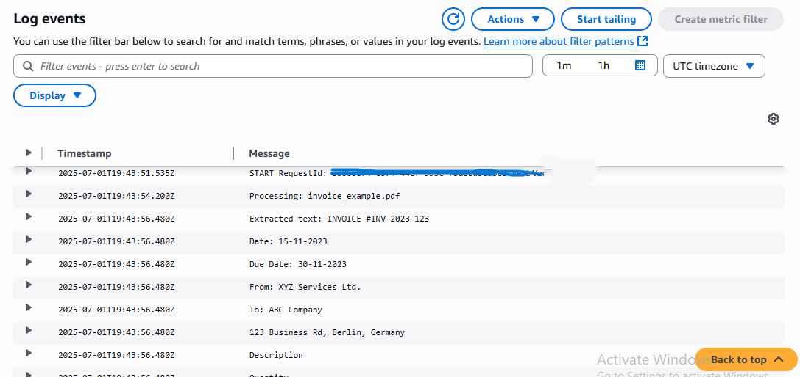
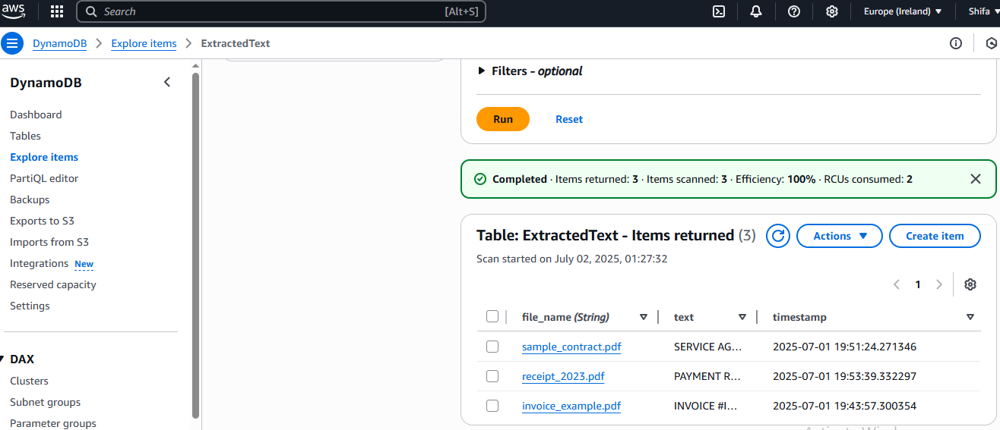
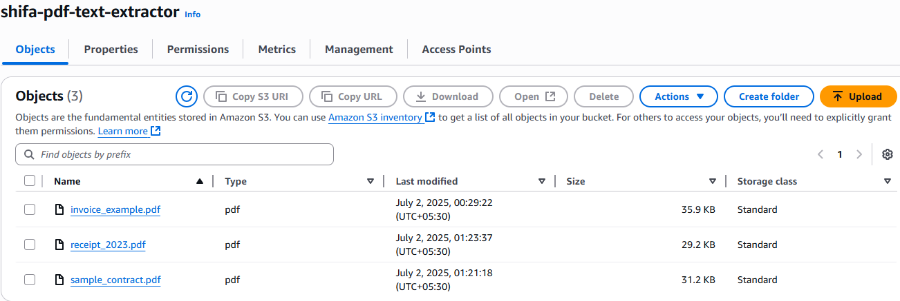

# AWS PDF Text Extractor (Serverless Automation)

Automatically extracts text from uploaded PDFs using AWS serverless architecture.

## Architecture  
1. **S3 Trigger**: Upload PDFs to an S3 bucket  
2. **Lambda Processing**: Python function triggers automatically  
3. **Textract**: AWS AI service extracts text  
4. **DynamoDB**: Stores extracted text with timestamps  

## Screenshots  
  
  
  

## Technical Skills  
- **AWS Services**: Lambda, S3, Textract, DynamoDB  
- **Python**: Boto3 for AWS integration  
- **Serverless Design**: Zero infrastructure management  

## Notes  
- Project resources deleted post-demo to optimize costs.  
- Code can be reused for document processing workflows.
  
## Quick Deployment  
1. Clone this repo  
2. Deploy `lambda_function.py` with S3/DynamoDB permissions  
3. Set up S3 bucket trigger
   
## Key Learnings  
- Serverless event-driven architectures  
- AWS service integration (Lambda, Textract)  
- Cloud cost optimization  
